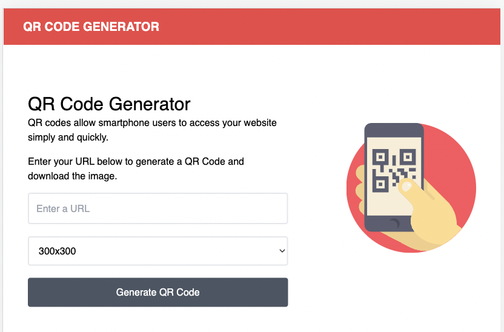
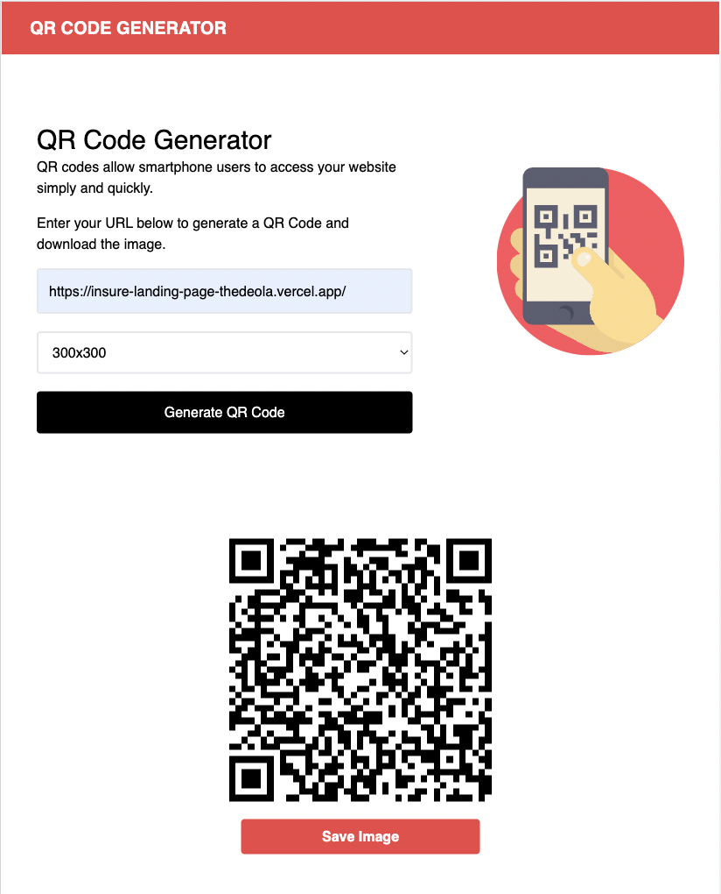
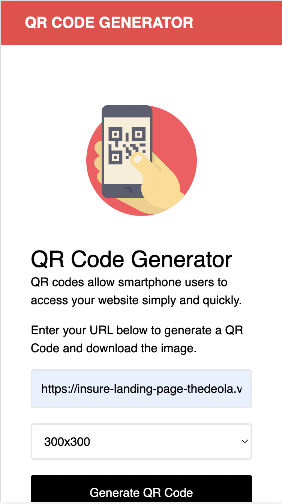

# Traversy Media - QR Code Generator

This is a solution to the [Traversy Media - QR Code Generator](https://www.youtube.com/watch?v=qNiUlml9MDk)

## Table of contents

- [Overview](#overview)
  - [The challenge](#the-challenge)
  - [Screenshot](#screenshot)
  - [Links](#links)
- [My process](#my-process)
  - [Built with](#built-with)
  - [What I learned](#what-i-learned)
  - [Continued development](#continued-development)
  - [Useful resources](#useful-resources)
- [Author](#author)

## Overview

### The challenge

Users should be able to:

- Enter a URL link and generate a QR code image
- Scan the QR code image and click to visit the URL
- Download the QR code image

### Screenshot

### Links

- Solution URL: [Solution](https://your-solution-url.com)
- Live Site URL: [Live Site](https://your-live-site-url.com)

## My process

### Built with

- Semantic HTML5 markup
- CSS custom properties
- [Tailwind CSS](https://tailwindcss.com/docs/installation/play-cdn) - CSS Framework
- Flexbox
- Mobile-first workflow
- [qrcode.js](https://davidshimjs.github.io/qrcodejs/) - Cross-browser QRCode generator for javascript

### What I learned

I learnt and understood the concept of how QR codes work and also better understand using the Tailwind CSS framework.

### Continued development

Constant development and testing of JavaScript processes

### Useful resources

- [Traversy Media](https://tailwindcss.com/docs/installation/play-cdn)
- [Tailwind](https://tailwindcss.com/docs/installation/play-cdn)

## Author

- Website - [TheDeola](https://thedeola.netlify.app/)
- Frontend Mentor - [@TheDeola](https://www.frontendmentor.io/profile/TheDeola)
- Twitter - [@deolacodes](https://www.twitter.com/deolacodes)